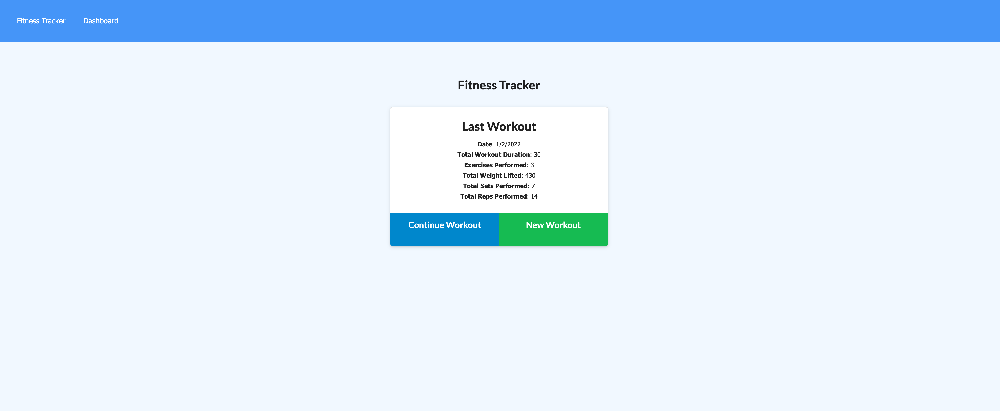

   # Fitness Tracker
   ## Table of contents     
   [description](#description)

[Deployed url](#Deployed-url)

[usage](#usage)

[Screenshots](#Screenshots)

[contribution](#contribution)

[testing](#testing)

[username](#username)

[email](#email)

[license](#license)

   ## Description
   Application that tracks workouts   

   ## Deployed-url
   
   [Deployed application](https://pbrownin-fitness-tracker.herokuapp.com/) on Heroku
    
   ## Usage

   * Click on new workout. 
   * Input the exercise parameters. 
   * Choose complete to complete that days workout or add additional exercises 

   ## Screenshots

   

   ## Contribution
   
   ## Testing instructions
   There is basic testing for this application via Mocha and Chai frameworks.

   ## Questions
   
   ### Email:
   philip741@gmail.com
   
   ### Username:
   philipbrowning
   
   ## License
   [License: MIT](https://opensource.org/licenses/MIT)
  